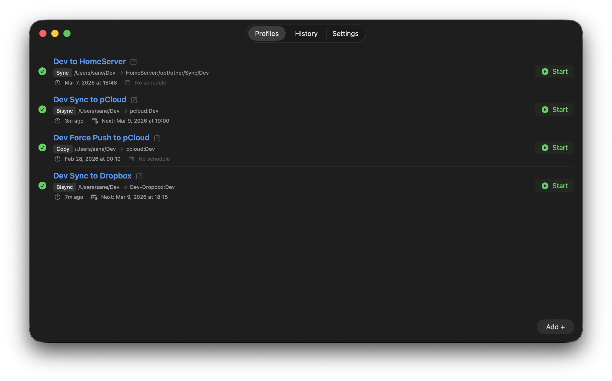

# Cirrus

A native macOS menu bar application for managing [rclone](https://rclone.org/) file synchronization jobs through reusable profiles. Replace your hand-written shell scripts with a GUI-driven workflow for configuring, executing, scheduling, and monitoring rclone operations across any supported remote.

## Screenshots

| Tray Popup | Profiles |
|:---:|:---:|
|  |  |

| History | Log Viewer |
|:---:|:---:|
|  |  |

## What It Does

Cirrus wraps rclone's CLI in a two-surface interface:

- **Tray popup** — Click the menu bar icon to see all your profiles with status badges, start/cancel jobs, and check last run times. Two clicks from icon to syncing.
- **Main window** — Full management interface with three tabs: Profiles (create, edit, delete, dry-run), History (per-profile run logs with syntax highlighting), and Settings (rclone path, version, config location).

### Key Features

- **Profile management** — Configure source folder, destination remote, rclone action (sync/copy/move/delete), ignore patterns, and extra flags per profile
- **Paste-to-create** — Paste an rclone command like `rclone sync ~/docs gdrive:backup --exclude "*.tmp"` and the parser auto-populates all form fields
- **Cron scheduling** — Visual builder or raw cron expression input. Jobs fire automatically while the app is running
- **Live log streaming** — Watch rclone output in real-time for running jobs
- **History & log viewer** — Per-profile run history with syntax-highlighted logs (red for errors, yellow for warnings)
- **Network detection** — Prevents job execution when offline
- **Status badges** — Color + SF Symbol shape indicators (green checkmark, red xmark, yellow clock) across tray popup, profile list, and history dropdown

### Supported rclone Actions

| Action | Behavior |
|--------|----------|
| `sync` | Make destination identical to source, deleting extra files on destination |
| `copy` | Copy files from source to destination without deleting anything |
| `move` | Move files from source to destination (deletes from source after transfer) |
| `delete` | Delete files on the remote matching the configured path |

## Requirements

- **macOS 14.0** (Sonoma) or later
- **Xcode 16.3** or later (for building)
- **rclone** — Cirrus auto-detects rclone in your PATH on first launch, or you can point it to a binary manually in Settings. You can also install rclone to `~/.local/bin` from within the app.
- **XcodeGen** — Used to generate the Xcode project from `project.yml`

## Building

### 1. Install XcodeGen

```bash
brew install xcodegen
```

### 2. Generate the Xcode project

```bash
cd Cirrus
xcodegen generate
```

### 3. Build

Open `Cirrus.xcodeproj` and build with Cmd+B, or build from the command line:

**Debug build:**

```bash
xcodebuild -project Cirrus.xcodeproj -scheme Cirrus -configuration Debug build
```

**Release build:**

```bash
xcodebuild -project Cirrus.xcodeproj -scheme Cirrus -configuration Release build
```

### 4. Find the built app

Both builds output to Xcode's DerivedData directory. To find the `.app` bundle:

```bash
# Debug
open $(xcodebuild -project Cirrus.xcodeproj -scheme Cirrus -configuration Debug -showBuildSettings | grep -m1 'BUILT_PRODUCTS_DIR' | awk '{print $3}')

# Release
open $(xcodebuild -project Cirrus.xcodeproj -scheme Cirrus -configuration Release -showBuildSettings | grep -m1 'BUILT_PRODUCTS_DIR' | awk '{print $3}')
```

The app bundle is at `Cirrus.app` inside that directory. For a distributable release, copy `Cirrus.app` from the Release build output to `/Applications` or wherever you'd like.

The default DerivedData paths are:

```
~/Library/Developer/Xcode/DerivedData/Cirrus-{hash}/Build/Products/Debug/Cirrus.app
~/Library/Developer/Xcode/DerivedData/Cirrus-{hash}/Build/Products/Release/Cirrus.app
```

### 5. Run

Run from Xcode (Cmd+R) or double-click `Cirrus.app` from the build products directory. The app starts silently in the menu bar — look for the cloud icon in your menu bar, not in the Dock.

## Running Tests

Tests use Apple's Swift Testing framework (`@Test`, `#expect()`).

```bash
xcodebuild test -project Cirrus.xcodeproj -scheme CirrusTests -destination 'platform=macOS'
```

Or run from Xcode via Cmd+U.

## How It Works

### Architecture

Cirrus is a thin orchestration layer. It doesn't process files — it assembles rclone commands from profile configurations and manages the execution lifecycle.

```
Menu Bar Icon (NSStatusItem)
    │
    ├── Tray Popup (NSPanel + SwiftUI)
    │     └── Profile rows with Start/Cancel/History
    │
    └── Main Window (SwiftUI Window)
          ├── Profiles Tab — CRUD, paste-to-create, dry-run
          ├── History Tab — per-profile run list, log viewer
          └── Settings Tab — rclone path, version, config directory
```

### Data Flow

Five `@MainActor @Observable` manager classes share state across both UI surfaces:

| Class | Responsibility |
|-------|---------------|
| `AppSettings` | rclone path, config directory, version detection |
| `ProfileStore` | Load/save/delete profiles as individual JSON files |
| `JobManager` | Spawn rclone `Process` instances, track running jobs, capture output |
| `LogStore` | JSON log index + raw log files per execution |
| `ScheduleManager` | 5-second evaluation loop, cron expression matching, persisted fire dates |

### File Storage

All data lives in `~/.config/cirrus/` by default (configurable in Settings):

```
~/.config/cirrus/
├── settings.json              # App settings (rclone path, config dir)
├── schedule-state.json        # Last fire dates for scheduled jobs
├── profiles/
│   ├── {uuid}.json            # One file per profile
│   └── ...
└── logs/
    ├── index.json             # Log entry metadata (profile, status, duration)
    └── runs/
        ├── {profileId}_{timestamp}.log   # Raw rclone output
        └── ...
```

Profile JSON files are written atomically (temp file + rename) to prevent corruption.

### Job Execution

When you start a job:

1. Profile config is snapshotted (value-type copy) — edits during execution don't affect the running job
2. Ignore patterns are written to a temp filter file
3. rclone is spawned via Swift `Process` with stdout/stderr pipes
4. Output streams to the UI in real-time and is appended to a log file
5. On completion, the log entry is finalized with status and duration
6. The temp filter file is cleaned up

### Scheduling

The `ScheduleManager` runs a 5-second evaluation loop while the app is running. For each profile with an active schedule, it calculates the next fire date from the cron expression and triggers `JobManager` when due. Last fire dates are persisted to `schedule-state.json` so jobs don't re-fire on app restart.

### Quit Behavior

- Closing the main window keeps the app running in the menu bar
- Quitting shows a confirmation dialog warning about running jobs and active schedules
- On quit, all running rclone processes are terminated

## Project Structure

```
Cirrus/
├── project.yml                # XcodeGen project definition
├── Cirrus/
│   ├── CirrusApp.swift        # App entry point, dependency wiring
│   ├── AppDelegate.swift      # NSStatusItem, tray popup, quit handling
│   ├── Models/                # Profile, CronSchedule, JobRun, LogEntry, JobStatus
│   ├── Stores/                # AppSettings, ProfileStore, JobManager, LogStore, ScheduleManager
│   ├── Services/              # RcloneService, RcloneCommandParser, FilterFileWriter
│   ├── Utilities/             # CronParser, AtomicFileWriter, CirrusError, NetworkMonitor, JSONCoders
│   └── Views/
│       ├── TrayPopup/         # TrayPopupPanel, TrayPopupView, TrayPopupState, PopupProfileRow, PopupEmptyState
│       ├── MainWindow/        # MainWindowView, Profiles/, History/, Settings/
│       └── Components/        # StatusBadge, CronBuilderView, GUIProfileRow
└── CirrusTests/               # Mirror of source structure with Swift Testing tests
```

## License

This project is not yet licensed. All rights reserved.
